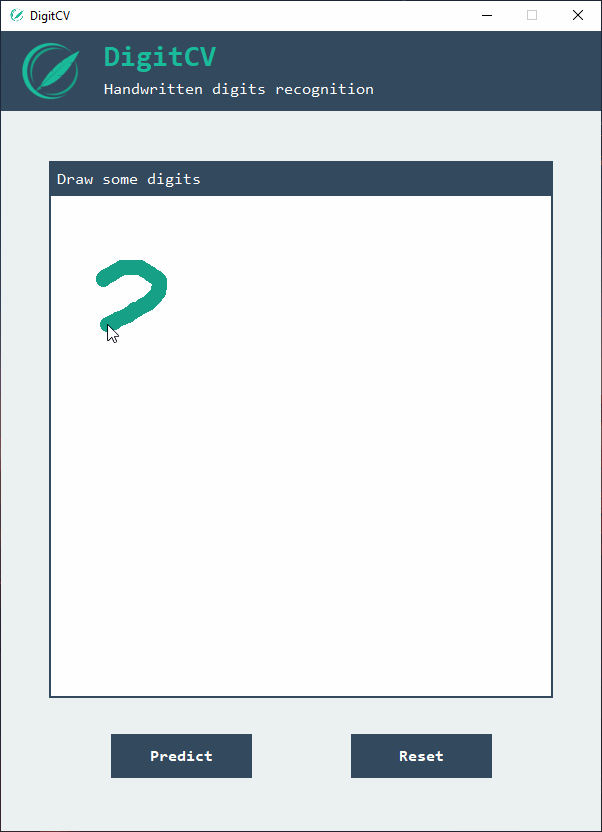

# DigitCV


A computer vision application that uses convolutional neural network for handwritten digits recognition. Neural network powered by TensorFlow and trained on the MNIST database, using an augmented data generator. A graphical user interface allows you to draw some digits for the model to recognize.



## Installation

Installation within a virtual environment using `venv`. Requires Python version 3.5-3.8 for [compatibility with TensorFlow](https://www.tensorflow.org/install/pip?hl=en). Here are the installation steps for Windows and Linux-based systems (app untested on MacOS).


### Windows
```
git clone https://github.com/ghesrob/DigitCV.git
cd DigitCV
python -m venv venv
venv/scrits/activate.ps1
pip install -r requirements.txt
```

### Linux
```
git clone https://github.com/ghesrob/DigitCV.git
cd DigitCV
python3 -m venv venv
source venv/bin/activate
pip3 install requirements.txt
```

## Usage
Execute `python gui.py` (or `python3 gui.py` for Linux users) to start the graphical user interface. Draw some digits on the dedicated area, and press **predict** to let the CNN recognize your handwriting.

